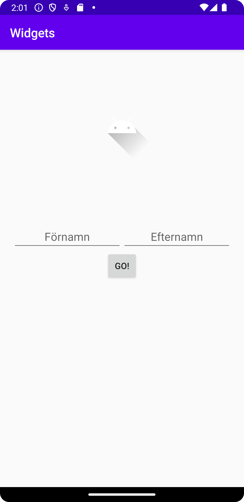

# Rapport

**Skriv din rapport här!**
I uppgift nummer 2 har en layout redogjorts i appen. Jag valde att använda linearlayout, linearlayout är inte default så det första jag behövde göra var att ändra till linearlayout.
```
<LinearLayout xmlns:app="http://schemas.android.com/apk/res-auto"
    xmlns:tools="http://schemas.android.com/tools"
    xmlns:android="http://schemas.android.com/apk/res/android"
    android:layout_width="match_parent"
    android:layout_height="match_parent"
    android:orientation="vertical"
    android:padding="20dp"
    tools:context=".MainActivity">
</LinearLayout>
```

Nästa sak var att lägga till lite widgets. Det första jag började med var att lägga till en bild. Det gjordes på detta sätt;
```
<ImageView
        android:layout_width="match_parent"
        android:layout_height="wrap_content"
        android:layout_marginTop="50dp"
        android:layout_marginStart="50dp"
        android:layout_marginEnd="50dp"
        android:contentDescription="Android Logo"
        app:srcCompat="@drawable/ic_launcher_foreground" />

```
I koden har även margins användts för att centrera bilden. Denna teknik kommer att användas med alla widgets.
Nästa som las till var två stycken textedits, de gör så man kan skriva in saker i appen. Två stycken olika gjordes en för förnamn och en för efternamn.
```
<EditText
            android:layout_width="match_parent"
            android:layout_height="wrap_content"
            android:layout_marginTop="100dp"
            android:layout_weight="1"
            android:gravity="center_horizontal"
            android:hint="Förnamn"
            android:inputType="text"
            android:textAlignment="center" />
```
Sista delen av appen var en button så att man skulle kunna skicka iväg information om man fortsätter med appen.Det gjordes på följade vis;

```
<Button
        android:layout_width="wrap_content"
        android:layout_height="wrap_content"
        android:text="Go!"
        android:layout_marginStart="150dp"
        android:layout_marginEnd="150dp"/>
```


